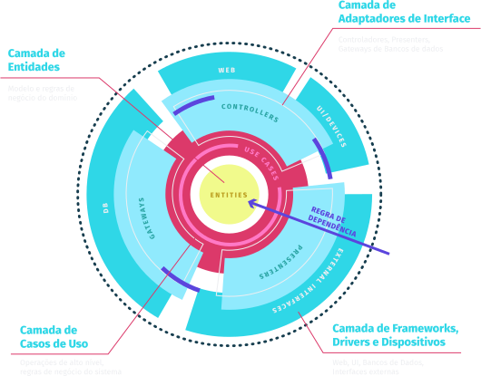

  
  

    <h1>Yazalde Filimone</h1>
    
Actualmente Tenho 17 e sou Desevolvedor FullStack,
    Sou literalmente um <strong>Geeks</strong> e apaxionado por programacao e tecnologia.

    

    <strong>Por que gosto de programar:</strong> 
    
    Os computadores são maravilhosos porque quando você trabalha com eles obtém resultados imediatos que lhe permitem saber se seu
    programa funciona. Poucas coisas na vida lhe dão um retomo desses.
    Foi aí que começou meu fascínio por software.
    

  

  

  

  A minha paixao com a ciencia inicia na 8 Classe qundo tive a minha primeira aula de fisica desde entao vivia me focando em matematica e fisica, querendo ser inventor, como o (Albert Eisntein3), mas depois de 2 anos eu entrei na area de tecnologia bem especifico na are de hacking mas eu sabia que faltava algo, comecei od meu estudos com python(automacao e scripts de hacking) durante 1 ano,  mas python  nao me satisfazia, entao fui pra o javascript na area de desevolvimento web e siceramente me apaxionei pela area e me dediquei o maximo, e comei a estudar arquitetura e padroes de projeto (Clean Archiqueture e Test Drive Developement).
  

  

  

    <h2>Minhas Expiracoes</h2>
    
De inicio ja vou avisando nao espere ver os grandes nomes da programacoe ou alho semelhante, o que me chama atencao nas pessoas que estao aqui pouca das vezes e o comhecimento que a pesso carega nas costas.

  

  

    <ul>
      <li>Edmilson Jesus - <strong>FullStack Javascript</strong></li>
      <li>Diego Fernandes - <strong>FullStack Javascript</strong></li>
      <li>Rogrido Manguinho - <strong>FullStack Javascript</strong></li>
      <li>Guilherme Rodz - <strong>FullStack Javascript</strong></li>
    </ul>
  

