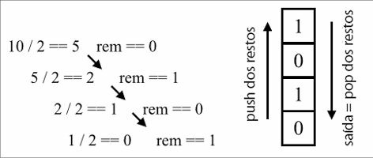

# Resolvendo problemas usando pilhas.

As pilhas têm uma variedade de aplicações nos problemas do mundo real.
Elas podem ser usadas para problemas de **backtracking**, a fim de lembrar as tarefas ou os caminhos visitados, e para desfazer ações (veremos como aplicar esse exemplo quando discutirmos grafos e problemas de backtracking
mais adiante). As linguagens de programação **C#, Java** (e outras) usam pilhas para armazenar variáveis e chamadas de métodos e quando houver uma **exceção de stack overflow** (transbordamento de pilha: "Agora sabe porque o maior site de pesquise sobre programcao e chamando stack overflow kkk.") que possa ser lançada, em especial quando trabalhamos com **algoritmos recursivos** (que discutiremos posteriormente).
Agora que já sabemos como usar a classe Stack, vamos utilizá-la para
resolver alguns problemas de **ciência da computação**. Nesta seção,
discutiremos o problema de decimal para binário; nessa ocasião,
transformaremos também o algoritmo em um **conversor de base**.

## Convertendo números decimais para binários

Já temos familiaridade com a **base decimal**. No entanto, a representação **binária** é muito importante em ciência da computação, pois tudo em um computador é **representado por dígitos binários (0 e 1)**. Sem a capacidade de
**converter números decimais para binários e vice-versa**, seria um pouco difícil se comunicar com um computador.
Para converter um número decimal em uma representação binária, **podemos
dividir o número por 2 (binário é um sistema numérico de base 2) até que o
resultado da divisão seja 0**. Como exemplo, converteremos o número 10 em
dígitos binários:

  

Ficou mias facil com a imagem acime ne? Boa entao vamos codar.

Feito com 💙 por [Yazalde Filimone](https://github.com/yazaldefilimonepinto)
